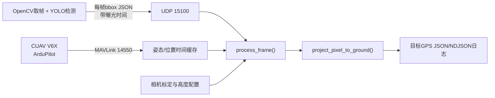

# Jetson bbox 地面目标定位教程

这个模块完成一件事：把目标检测得到的图像位置，与同一曝光时刻的飞机 GPS、
高度和姿态组合，估计目标在地面的经纬度。

当前版本的边界很明确：

- 接收 bbox JSON；
- 接收并缓存 ArduPilot MAVLink 遥测；
- 插值曝光时刻的位置和姿态；
- 将目标像素投影到局部地面；
- 输出目标 GPS 和质量信息；
- 不解锁、不切换模式、不上传航点、不控制 A1 舵机。

先把定位误差测清楚，再单独设计动作状态机，可以避免误识别直接驱动机构。

## 1. 整体数据流



为什么必须按“帧”组织数据：同一帧里的全部 bbox 共享同一个曝光时间、图像
分辨率和飞行器状态。每个 bbox 重复携带一份姿态和位置不仅浪费，还容易造成
状态不一致。

YOLO和OpenCV在这里分工不同：

- YOLO负责识别类别，并输出bbox、置信度和可选的分割掩码；
- OpenCV可以负责相机取帧、内参标定、畸变处理和图像坐标操作；
- `target_geolocation` 不关心具体使用哪个YOLO模型，只要求收到约定格式的JSON；
- `core.py` 使用 `cv2.undistortPoints()`，因此即使检测由YOLO完成，定位数学仍会
  使用OpenCV。

## 2. 文件分别负责什么

### `core.py`：纯数学核心

这个文件不连接飞控，也不接收网络数据，主要包含：

- `CameraCalibration`：相机内参、畸变、安装旋转和平移；
- `VehiclePose`：飞机经纬度、MSL高度和滚转/俯仰/航向；
- `rotation_ned_from_body()`：机体 FRD 转 NED 的旋转矩阵；
- `bbox_anchor()`：从 bbox 选择实际投影点；
- `project_pixel_to_ground()`：像素射线与局部地面求交；
- `ensure_image_matches()`：阻止错误分辨率使用错误内参。

先读这个文件最容易理解算法，因为它没有线程、UDP 和 MAVLink 干扰。

### `controller.py`：数据融合控制器

主要包含：

- `ClockAligner`：估计 Jetson 单调时钟与飞控启动时钟的偏移；
- `TelemetryBuffer`：保存和插值姿态、位置、地形高度；
- `MavlinkReceiver`：后台接收 MAVLink；
- `process_frame()`：把一帧检测结果与对应时刻遥测融合；
- `main()`：读取配置、监听UDP、打印和保存结果。

### 其他文件

- `send_test_detection.py`：发送一帧模拟bbox；
- `test_core.py`：验证像素中心、右侧、上侧和yaw旋转方向；
- `test_controller.py`：验证JSON、时间、位置和姿态能组成完整结果。

## 3. 必须理解的坐标系

程序同时使用四个坐标系。方向错一个，目标GPS就会镜像或旋转。

| 坐标系 | X轴 | Y轴 | Z轴 |
|---|---|---|---|
| OpenCV相机 | 图像向右 | 图像向下 | 镜头光轴向前 |
| ArduPilot机体FRD | 机头向前 | 右翼向右 | 机腹向下 |
| NED | 北 | 东 | 向下 |
| WGS84 | 纬度 | 经度 | MSL海拔向上 |

`rotation_body_from_camera` 的含义是：

```text
相机坐标向量  --R_body_camera-->  机体FRD向量
```

随后飞机姿态提供：

```text
机体FRD向量  --R_ned_body-->  NED向量
```

因此完整方向变换是：

```text
ray_ned = R_ned_body @ R_body_camera @ ray_camera
```

配置模板里的安装矩阵只适用于：

- 相机光轴垂直指向机腹方向；
- 图像顶部朝飞机机头；
- 图像右侧朝飞机右翼。

如果你的相机不是这样安装，不能直接使用模板矩阵。

## 4. bbox到底取哪个像素

检测器输出：

```text
bbox_xyxy = [x1, y1, x2, y2]
```

平铺在地面的标志可以取几何中心：

```text
u = (x1 + x2) / 2
v = (y1 + y2) / 2
```

人、车辆或其他有高度的目标，通常取底边中心近似接地点：

```text
u = (x1 + x2) / 2
v = y2
```

因此默认配置是：

```json
"bbox_anchor": "bottom_center"
```

如果检测器已经算出更可靠的接地点，可以直接在JSON里发送：

```json
"ground_anchor_uv": [125.0, 130.0]
```

程序会优先使用它，而不是重新从bbox计算。

## 5. 像素如何变成GPS

### 第一步：去畸变并形成相机射线

理想针孔模型中：

```text
ray_camera ∝ K⁻¹ · [u, v, 1]ᵀ
```

实际代码先调用 `cv2.undistortPoints()` 去除径向和切向畸变，再形成：

```python
ray_camera = [x_normalized, y_normalized, 1]
```

这里的 `K` 是相机内参矩阵：

```text
K = [ fx   0  cx ]
    [  0  fy  cy ]
    [  0   0   1 ]
```

`fx/fy` 决定视场角和尺度，`cx/cy` 是主点。不能用零值或从其他分辨率复制。

### 第二步：相机射线转NED

```text
ray_ned = R_ned_body · R_body_camera · ray_camera
```

`R_ned_body` 使用曝光时刻的 `roll/pitch/yaw` 计算。因此飞机不需要严格平飞，
滚转和俯仰已经包含在射线方向中。

### 第三步：射线与地面求交

当前实现把目标附近地面近似为局部水平面。设：

- `H` 是飞机参考点真实离地高度；
- `offset_ned` 是相机相对飞控/GPS参考点的位置；
- `ray_ned.z` 是射线的向下分量。

那么：

```text
camera_agl = H - offset_ned.z
scale      = camera_agl / ray_ned.z
target_ned = offset_ned + scale · ray_ned
```

如果 `ray_ned.z` 很小，说明镜头射线接近地平线。此时一点角度误差会变成很大
的地面位置误差，程序会通过 `min_ray_down_component` 拒绝结果。

### 第四步：NED平移转经纬度

短距离内使用局部近似：

```text
target_lat = vehicle_lat + north / EarthRadius
target_lon = vehicle_lon + east / (EarthRadius · cos(vehicle_lat))
```

代码最终输出目标纬度、经度、北东偏移和斜距。

## 6. 没有测距仪时，高度从哪里来

仅靠单目bbox、相机内参和姿态只能得到一条空间射线，无法确定目标在射线上的
距离。必须另外提供地面高度或AGL尺度。

当前版本不包含测距仪代码，支持以下来源。

### `terrain`：ArduPilot地形高度

```json
"agl_source": "terrain"
```

控制器读取 `TERRAIN_REPORT.current_height`。需要飞控已经具备相应地形数据，
并且消息在允许时间内到达。

### `ground_alt_msl`：已知区域地面MSL海拔

```json
"agl_source": "ground_alt_msl",
"ground_alt_msl_m": 35.2
```

程序使用：

```text
AGL = GLOBAL_POSITION_INT.alt_msl - ground_alt_msl
```

适合已测量、比较平坦的试验区域。

### `fixed`：固定AGL

```json
"agl_source": "fixed",
"fixed_agl_m": 50.0
```

只适合仿真、地面调试或高度确定且基本不变的试验。

### `relative_alt`：相对Home高度

```json
"agl_source": "relative_alt",
"allow_relative_alt_fallback": true
```

只有目标地面与Home地面基本同高时才可近似使用。地形起伏时，
`relative_alt` 不是真实AGL。

### `auto`的选择顺序

```text
terrain
→ ground_alt_msl_m
→ fixed_agl_m
→ relative_alt（只有显式允许时）
```

## 7. 为什么曝光时间比识别完成时间重要

目标图像在 `t_capture` 曝光，但YOLO可能在几十或几百毫秒后才输出bbox。如果
使用识别完成时的最新姿态，飞机已经移动和转动。

例如地速 `20m/s`，时间错位 `100ms`，仅平移误差就可能达到约 `2m`。

正确做法是在取帧时立即保存：

```python
capture_monotonic_ns = time.monotonic_ns()
```

并把它和这一帧的bbox一起发送。`TelemetryBuffer` 会在缓存中插值得到对应时刻
的 `ATTITUDE` 和 `GLOBAL_POSITION_INT`。

控制器支持三种时间来源：

1. `capture_time_boot_ms`：飞控启动时钟，优先级最高；
2. `capture_monotonic_ns`：同一台Jetson的 `time.monotonic_ns()`；
3. UDP接收时间：缺少时间戳时的回退，不适合精确定位。

当前 `ClockAligner` 根据MAVLink消息的 `time_boot_ms` 和Jetson接收时刻估计时钟
偏移。它适合第一阶段联调；追求更高精度时，应继续加入 `TIMESYNC`、硬件触发
或相机驱动提供的曝光时间戳。

## 8. 输入JSON协议

每个UDP数据报表示一帧：

```json
{
  "version": 1,
  "camera_id": "down_cam",
  "frame_id": 42,
  "capture_monotonic_ns": 123456789000,
  "image": {
    "width": 320,
    "height": 240
  },
  "detections": [
    {
      "detection_id": 0,
      "track_id": 7,
      "class_id": 2,
      "class_name": "target",
      "confidence": 0.93,
      "bbox_xyxy": [100, 70, 150, 130],
      "ground_anchor_uv": [125, 130]
    }
  ]
}
```

字段约定：

| 字段 | 单位/含义 |
|---|---|
| `frame_id` | 相机帧序号，用于发现丢帧和重复帧 |
| `capture_monotonic_ns` | Jetson单调时钟纳秒 |
| `capture_time_boot_ms` | 可选，飞控启动时钟毫秒 |
| `image.width/height` | 实际检测图像分辨率 |
| `bbox_xyxy` | 左上角原点的像素坐标 |
| `ground_anchor_uv` | 可选，真正用于投影的像素 |
| `track_id` | 多帧中同一个目标的跟踪ID |
| `confidence` | 检测置信度，当前只透传，不替你决定阈值 |

图像尺寸必须和标定尺寸一致，否则程序拒绝计算。因为图像缩放后，`fx/fy/cx/cy`
也会变化。

## 9. 输出JSON怎么读

每个目标输出一行NDJSON：

```json
{
  "type": "target_geolocation",
  "frame_id": 42,
  "track_id": 7,
  "valid": true,
  "capture_time_boot_ms": 58234.5,
  "anchor_uv": [125.0, 130.0],
  "target": {
    "latitude_deg": 1.3520834,
    "longitude_deg": 103.8198361
  },
  "offset_ned_m": [43.2, -7.4, 50.0],
  "slant_range_m": 66.5,
  "quality": {
    "timestamp_source": "jetson_monotonic",
    "pose_age_ms": 4.2,
    "agl_source": "ground_alt_msl",
    "agl_age_ms": 0.0,
    "vehicle_agl_m": 50.0,
    "ray_down_component": 0.75,
    "gps_h_acc_m": 1.2,
    "uncertainty_m": null
  }
}
```

重要字段：

- `valid`：是否得到有效结果；
- `offset_ned_m`：目标相对飞机参考点的北、东、下偏移；
- `pose_age_ms`：姿态/位置样本距离曝光时刻有多远；
- `ray_down_component`：越接近0，投影对角度误差越敏感；
- `uncertainty_m`：目前还没有标定误差模型，所以保持 `null`。

如果失败，会输出：

```json
{
  "valid": false,
  "reason": "pose sample is stale by 302.1 ms"
}
```

不要丢弃失败原因，它是联调时最有用的信息之一。

## 10. 配置文件逐项说明

先复制模板：

```bash
cd ~/ai
cp target_geolocation/config.example.json target_geolocation/config.json
```

真实标定完成前必须保持：

```json
"calibrated": false
```

控制器会拒绝使用模板中的零内参。完成测量后填入：

```json
{
  "camera": {
    "calibrated": true,
    "camera_id": "down_cam",
    "image_width": 320,
    "image_height": 240,
    "camera_matrix": [
      [250.1, 0.0, 160.3],
      [0.0, 249.8, 119.7],
      [0.0, 0.0, 1.0]
    ],
    "distortion": [-0.12, 0.03, 0.001, -0.001, 0.0],
    "rotation_body_from_camera": [
      [0.0, -1.0, 0.0],
      [1.0, 0.0, 0.0],
      [0.0, 0.0, 1.0]
    ],
    "lever_arm_body_m": [0.15, 0.0, 0.08]
  }
}
```

上面的数字只是格式示例，不是你的相机参数。

`lever_arm_body_m=[x,y,z]` 使用机体FRD方向：

- `x>0`：相机在飞控前方；
- `y>0`：相机在飞控右侧；
- `z>0`：相机在飞控下方。

## 11. 运行方法

### 终端1：启动定位控制器

```bash
cd ~/ai

.venv/bin/python -m target_geolocation.controller \
  --config target_geolocation/config.json \
  --mavlink udpin:0.0.0.0:14550 \
  --listen 127.0.0.1:15100 \
  --output target_geolocation/results.ndjson
```

登录交互式终端后也可以使用 `uv run python ...`。这里使用 `.venv/bin/python`
是因为它不依赖shell是否把 `uv` 加入PATH。

注意：通常同一时间只能有一个进程绑定 `0.0.0.0:14550`。如果另一个测试脚本
正在监听MAVLink端口，应先停止它。

### 终端2：发送模拟bbox

```bash
cd ~/ai
.venv/bin/python -m target_geolocation.send_test_detection
```

## 12. YOLO如何发送一帧JSON

可以用OpenCV读取相机画面，再交给YOLO推理。关键点是先取得图像和对应的采集
时间，再运行推理：

项目根目录的 `stream.py` 已经实现该流程，默认使用：

```text
CSI相机：sensor-id 0，1280×720，30 FPS
YOLO模型：model/exp-3.engine
跟踪器：ByteTrack
JSON目的地址：127.0.0.1:15100
```

正常运行：

```bash
cd ~/ai
.venv/bin/python stream.py
```

无显示窗口运行：

```bash
.venv/bin/python stream.py --no-display
```

只处理一帧并打印实际JSON，适合联调：

```bash
.venv/bin/python stream.py --no-display --max-frames 1 --print-json
```

下面是 `stream.py` 中的核心逻辑简化版：

```python
import cv2
import json
import socket
import time

from ultralytics import YOLO


udp = socket.socket(socket.AF_INET, socket.SOCK_DGRAM)
camera = cv2.VideoCapture(0)
model = YOLO("model/exp-3.engine", task="detect")
frame_id = 0

# 优先使用相机驱动给出的曝光时间；没有时就在取帧返回后立即记录
ok, frame = camera.read()
capture_ns = time.monotonic_ns()
if not ok:
    raise RuntimeError("读取相机失败")

result = model.track(
    frame,
    tracker="bytetrack.yaml",
    persist=True,
    imgsz=640,
    conf=0.60,
)[0]
detections = []

for detection_id, box in enumerate(result.boxes):
    x1, y1, x2, y2 = box.xyxy[0].tolist()
    track_id = None if box.id is None else int(box.id[0].item())
    detections.append({
        "detection_id": detection_id,
        "track_id": track_id,
        "class_id": int(box.cls[0].item()),
        "confidence": float(box.conf[0].item()),
        "bbox_xyxy": [x1, y1, x2, y2],
        "ground_anchor_uv": [(x1 + x2) / 2.0, y2],
    })

message = {
    "version": 1,
    "camera_id": "down_cam",
    "frame_id": frame_id,
    "capture_monotonic_ns": capture_ns,
    "image": {"width": frame.shape[1], "height": frame.shape[0]},
    "detections": detections,
}

udp.sendto(
    json.dumps(message, separators=(",", ":")).encode("utf-8"),
    ("127.0.0.1", 15100),
)

frame_id += 1
```

当前YOLO内部使用 `imgsz=640` 推理，但返回的bbox会映射回传入的原始帧坐标。
如果原始帧是1280×720，JSON就必须写1280×720，并使用1280×720对应的内参。
像素坐标和内参必须属于同一图像分辨率。

## 13. 推荐的代码阅读路径

### 第一步：看四个方向测试

打开 `test_core.py`：

- 图像中心应投影到飞机正下方；
- 图像右边应落在东侧；
- 图像顶部应落在北侧；
- yaw旋转90°后，图像顶部应由北转向东。

这些测试比直接看旋转矩阵更直观。

### 第二步：跟进 `project_pixel_to_ground()`

按以下顺序看：

```text
像素合法性检查
→ cv2.undistortPoints
→ ray_camera
→ R_ned_body
→ camera_offset_ned
→ ray_ned
→ 与地面求交
→ 北东偏移转经纬度
```

### 第三步：看 `process_frame()`

```text
检查图像尺寸
→ 解析图像采集时间
→ 插值pose
→ 获取AGL
→ 为每个detection选择anchor
→ 调用投影核心
→ 组织结果JSON
```

### 第四步：最后看线程和网络

理解数学后再看 `MavlinkReceiver` 和 `main()`，否则容易被线程、socket和异常处理
分散注意力。

## 14. 测试

```bash
cd ~/ai

.venv/bin/python -m unittest discover \
  -s target_geolocation -p 'test_*.py' -v
```

测试不连接飞控、不发送舵机命令，也不需要相机。

你可以尝试修改测试中的像素和姿态，观察北东偏移如何变化，这是学习坐标变换
最快的方法。

## 15. 常见错误与判断方法

### `camera.calibrated is false`

正常保护。说明还没有填写真实内参和安装参数。

### `frame resolution ... does not match calibration`

检测图像尺寸和标定尺寸不同。不要只改JSON数字，应为真实使用分辨率标定或正确
缩放内参。

### `no ATTITUDE samples around capture time`

没有收到姿态消息，或者控制器启动后还没有积累缓存。

### `no GLOBAL_POSITION_INT samples around capture time`

没有收到飞控融合位置。检查GPS和MAVLink消息流。

### `pose sample is stale`

图像时间戳和遥测时钟不一致，或者遥测频率太低、丢包严重。

### `no valid AGL source`

没有测距仪时必须配置地形、已知地面MSL、固定AGL，或明确允许relative_alt。

### `camera ray is too close to/above the horizon`

目标射线没有可靠指向地面。可能是飞机倾角过大、相机安装矩阵错误或目标太靠近
画面边缘。

### 结果左右镜像或前后颠倒

优先检查 `rotation_body_from_camera` 和图像是否被软件旋转/翻转。

### 平飞看起来正确，转弯时误差明显变大

优先检查：

- 图像曝光时间与姿态时间是否对齐；
- 相机安装角是否真实标定；
- 相机与GPS/飞控的杆臂是否填写；
- 地面是否仍可近似为水平面。

## 16. 当前模型的限制

- 单目射线必须依赖外部高度尺度；
- 当前假设目标附近地面为局部水平面；
- 尚未建立完整误差传播模型，`uncertainty_m` 为 `null`；
- 如果相机驱动不给出真实曝光时间，只能使用取帧返回时刻近似；
- 通用bbox对有高度目标存在接地点偏差；
- 当前只输出每帧坐标，还没有实现多帧目标融合。

推荐后续顺序：

1. 完成相机内参和安装外参标定；
2. 在已知地面坐标的标志上做静态验证；
3. 低速直线飞行，只记录结果；
4. 加入 `track_id` 多帧中值/卡尔曼滤波；
5. 根据实测误差建立 `uncertainty_m`；
6. 定位稳定后，再设计独立且默认关闭的动作状态机。

## 17. 不上飞机也能调试：记录、重放、归因

不要在飞行现场不断改参数。推荐把一次飞行保存成完整实验数据，落地后反复更改
标定和配置并重算。

### 17.1 飞行时记录什么

YOLO端记录每一帧bbox JSON，并限制原图保存频率，避免占满磁盘：

```bash
cd ~/ai
.venv/bin/python stream.py --no-display \
  --record-dir runs/test01/camera \
  --record-images detections \
  --record-image-fps 2 \
  --record-annotated
```

生成：

```text
runs/test01/camera/
├── session.json       # 相机、模型、阈值和分辨率
├── bbox.ndjson        # 每一帧检测结果，包括空帧
└── frames/            # 限频保存的原图和可选标注图
```

`--record-images detections`只保存检测到目标的图像；`all`保存所有抽样图像；`none`
只记录JSON。`--record-image-fps`只限制图片，bbox JSON仍然逐帧保存。

控制器同时记录遥测、bbox输入和结果：

```bash
.venv/bin/python -m target_geolocation.controller \
  --config target_geolocation/config.json \
  --mavlink udpin:0.0.0.0:14550 \
  --listen 127.0.0.1:15100 \
  --output runs/test01/results.ndjson \
  --events runs/test01/events.ndjson
```

`events.ndjson`包含ATTITUDE、GLOBAL_POSITION_INT、TERRAIN_REPORT、GPS_RAW_INT和
收到的bbox帧，因此可以重建当时的时间插值和投影输入。

### 17.2 落地后修改参数并重放

例如只修改`rotation_body_from_camera`或相机内参，然后执行：

```bash
.venv/bin/python -m target_geolocation.replay \
  --events runs/test01/events.ndjson \
  --config target_geolocation/config.json \
  --output runs/test01/replayed.ndjson
```

同一次飞行可以重放任意次数。这样能直接比较“安装俯仰角改0.5°后，目标GPS移动
多少”，无需再次起飞。

### 17.3 每个结果新增的诊断信息

`debug`字段记录：

- 飞机经纬度、MSL高度、roll/pitch/yaw和角速度；
- NED速度；
- 相机射线在camera、body和NED三个坐标系中的方向；
- GPS到相机的杆臂偏移；
- 时钟对齐延迟分布、曝光元数据占位；
- 输入变化1个单位会让目标移动多少米。

`debug.sensitivity`的含义：

| 字段 | 问题 |
|---|---|
| `roll_1deg` | 横滚或相机安装横滚错1°会偏多少米 |
| `pitch_1deg` | 俯仰或相机安装俯仰错1°会偏多少米 |
| `yaw_1deg` | 航向错1°会偏多少米 |
| `anchor_u_1px` / `anchor_v_1px` | bbox接地点错1像素会偏多少米 |
| `agl_1m` | 高度错1米会偏多少米 |
| `timestamp_10ms` | 图像时间错10毫秒会偏多少米 |

这些数值是局部灵敏度，不是假装精确的误差概率。它们能告诉你当前姿态和高度下
哪个误差源最危险。

### 17.4 使用已知地面目标判断原因

在地面放置一个GPS真值已知的标志，至少采集不同航向、速度和高度的多次飞越：

```bash
.venv/bin/python -m target_geolocation.analyze_results \
  runs/test01/results.ndjson \
  --truth 1.2345678 103.1234567
```

工具会输出平均北/东偏差、去除偏置后的散布、P95、RMSE、高频告警、平均灵敏度
和可能原因。判断规律：

- 固定方向偏差且散布小：优先检查内参、安装角、目标真值；
- 偏差主要沿飞行方向：优先检查图像时间戳和管线延迟；
- 误差随高度成比例增长：优先检查焦距、安装角和AGL；
- 转弯或大姿态时突然变差：优先检查姿态时间对齐、外参和滚动快门；
- 同一track随机散开：优先检查bbox接地点、GPS噪声和检测稳定性。

没有已知目标真值时，工具只能判断重复精度，无法区分“每次都稳定地偏5米”和
“真实准确”。

## 18. 录制YOLO训练视频

`stream.py`可以在检测和定位运行期间，同时录制未画框的原始图像：

```bash
.venv/bin/python stream.py --no-display \
  --training-video-dir runs/training01/video \
  --video-fps 10 \
  --video-segment-seconds 60 \
  --video-quality 85 \
  --video-max-total-gb 20
```

训练视频使用MJPEG AVI，默认每段60秒。与长MP4相比，每帧独立压缩更适合抽帧，
进程异常时也只可能影响当前分段。视频是原图，不包含bbox文字和框，避免污染训练
数据。

`video_frames.ndjson`记录每个视频帧对应的`source_frame_id`和
`capture_monotonic_ns`。当磁盘剩余空间低于`--min-free-disk-gb`或本次录像超过
`--video-max-total-gb`时，只停止训练录像，YOLO、bbox发送和定位继续运行。

## 19. 当前飞机的相机安装方向

当前按以下机械安装解释配置：

- 镜头垂直向下；
- “相机正方向”指图像上方；
- 图像上方相对飞机机头向左90°。

因此相机轴与FRD机体轴的映射为：图像右方对应机头前方，图像下方对应机体右方，
光轴对应机体下方，配置矩阵为单位矩阵：

```json
"rotation_body_from_camera": [
  [1.0, 0.0, 0.0],
  [0.0, 1.0, 0.0],
  [0.0, 0.0, 1.0]
]
```

如果“正方向”实际指的是排线方向或图像横轴，而不是图像上方，这个矩阵就不成立，
必须先用一张带机头方向的实拍图确认。
